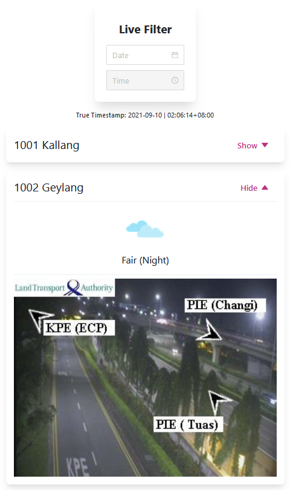

# meteor-app

## 1. Credits

Initial template reused from [my own TAP ESTL Assignment](https://github.com/Permas-Teo/salary-app)
This project was bootstrapped with [Create React App](https://github.com/facebook/create-react-app).
Navigation Bar component referenced from https://chakra-templates.dev/
Weather Icons made by Pixel perfect from [Flaticon](www.flaticon.com)

## 2. Setup Instructions

#### Install dependencies

In the repository root folder, install dependencies (npm 6.14.14):

`npm install`

#### Run React webapp

In the repository root folder, to run React webapp:

`npm start`

Server runs by default at http://localhost:3000

#### Run tests

In the repository root folder, to run tests:

`npm test`

## 2. Assignment Writeup

1. Live filter implementation, there is no need to click on a button to apply the filter.
1. Timepicker is disabled until a valid date is selected by the Datepicker.
1. True Timestamp denotes actual timestamp returned by api call.
1. The location data can be displayed via a Show/Hide toggle button.
